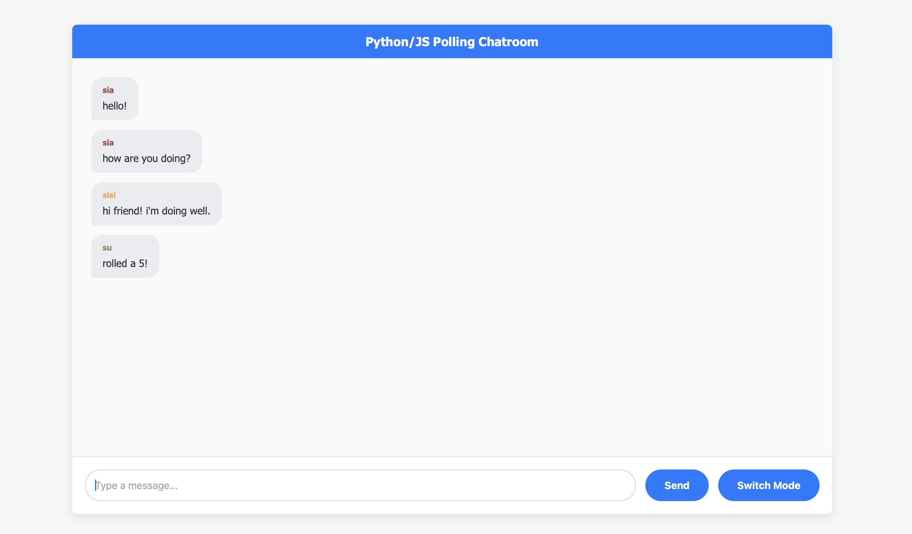

# Online Chatroom

This full-stack web application serves an an online chatroom that allows multiple users to chat across different browsers.

## Live Demo
[https://github.com/xq675/online_chatroom](https://github.com/xq675/online_chatroom)

## Technologies
- Python
- Flask
- Jinja
- REST API
- HTML
- CSS
- JavaScript
- JSON

## Key Features
- Built a full-stack asynchronous web application featuring a multi-browser chatroom powered by Flask and a custom JavaScript short-polling architecture that syncs message data dynamically every second
- Designed a robust REST API pipeline using JSON payloads for secure authentication on both client and server side
- Implemented real-time visual and interactive enhancements, including a stateful cookie-based session manager, a specialized server-side chat command parser, and a dynamic client-side theme switcher via DOM manipulation

